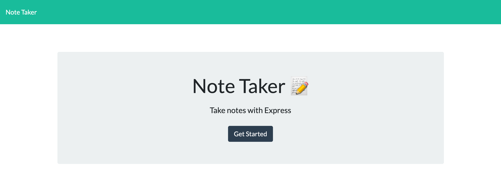
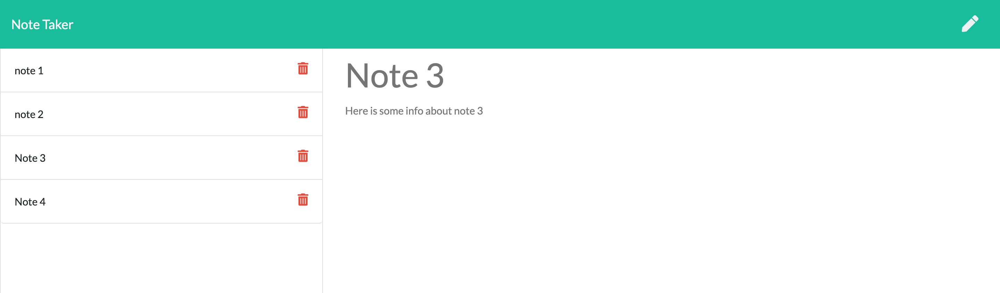

# Note Taker
      
    


## Description

This app allows you to take notes on whatever is on your mind and keep them organized. Your notes will be automatically saved on a server for you to access at any time. The app lists the name of all of your notes and when you click on them they will be displayed on the main page for you to see in more detail and if you want to use the information in JSON format, you can do so by querying /api/notes. This app utilizes node.js, express.js, JSON files for storing information, fs, promises and more!


​


​

## Table of Contents

* [Installation](#installation)
* [License](#license)
* [Questions](#questions)


## Installation

To install necessary dependencies, run the following command:

``` npm i ```


## License

This project is licensed under the APACHE 2.0 license.


## Questions

If you have any further questions, you can reach me directly here: lovins.jacob@yahoo.com

You can find more of my work at [https://github.com/jacoblovins/](https://github.com/jacoblovins/).